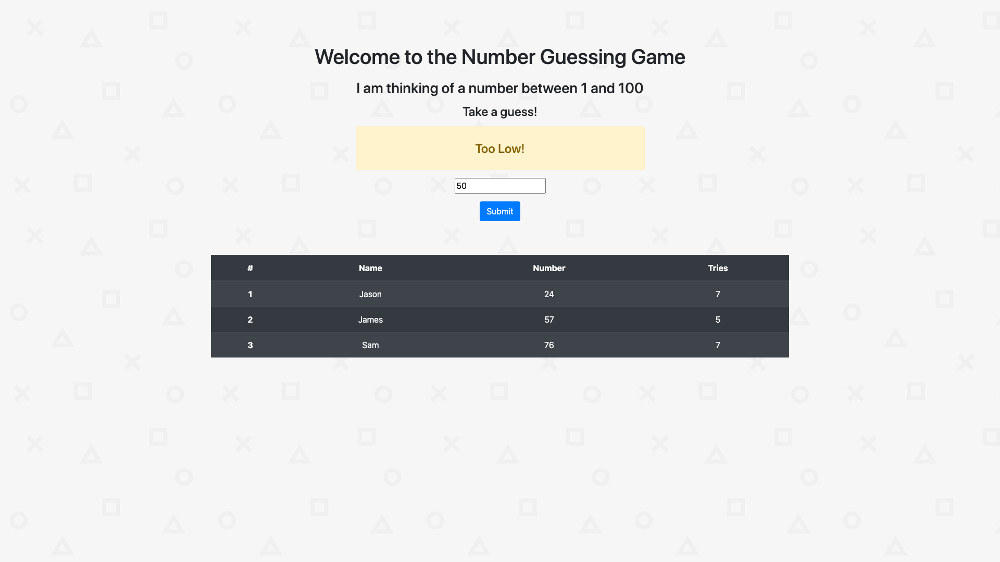
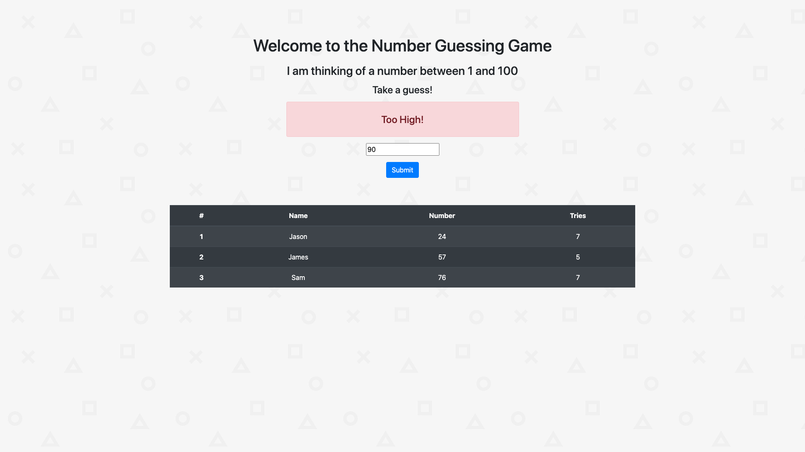
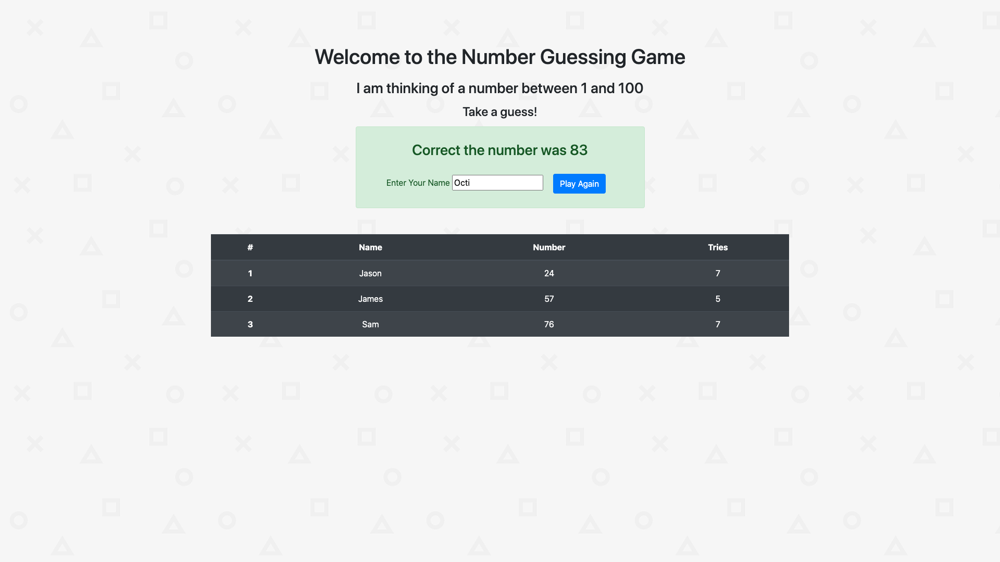

# NumberGuesserGame
This is a fun guessing game that a user can play in the browser. The browser generates a random number from 1 - 100 and the user should try to guess what that number is. The browser lets the user know when their guess is too low or too high. If the user guesses the number correctly than they can add their name and they will be added to the leaderboard of users that have played along side with the number they were attempting to guess and how many tries it took them to guess the number.

# What I learned
* Practice Flask
* Use of session
* USe of redirect
* Use of Jinja
 
# Screenshots

